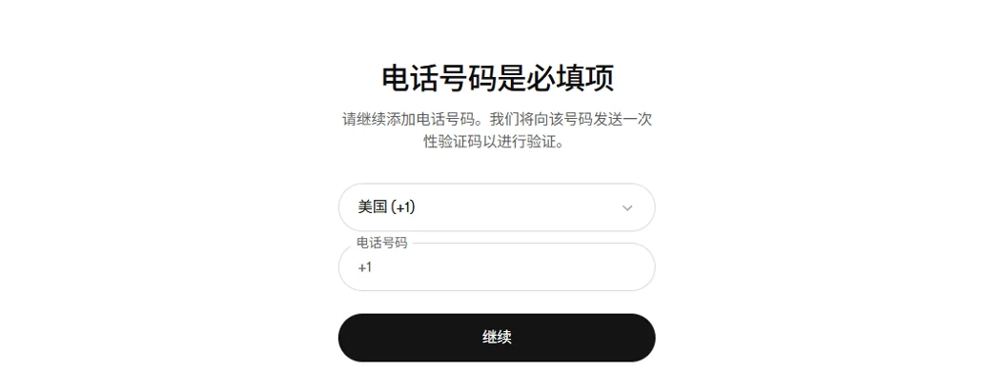
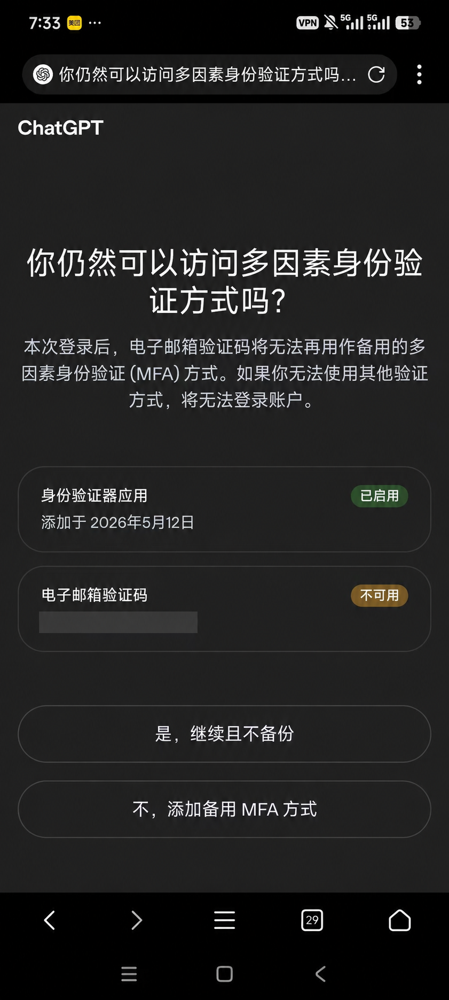
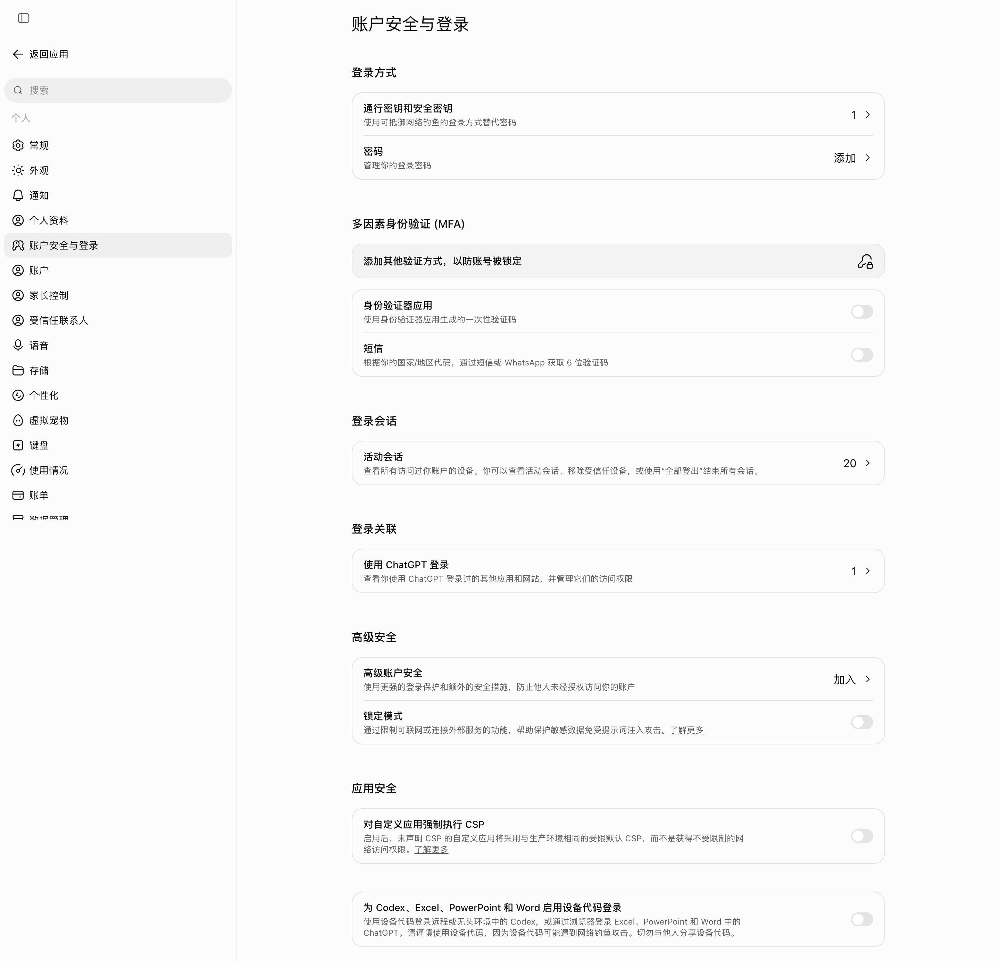
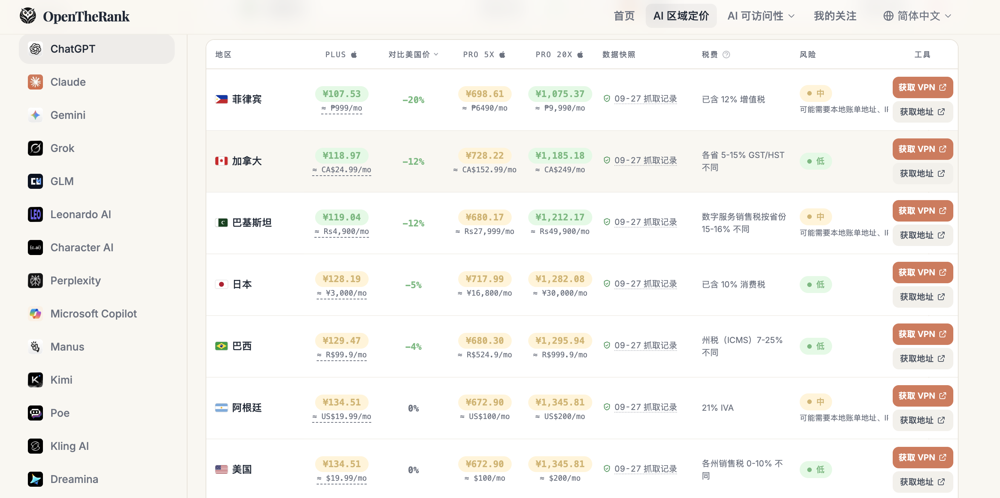
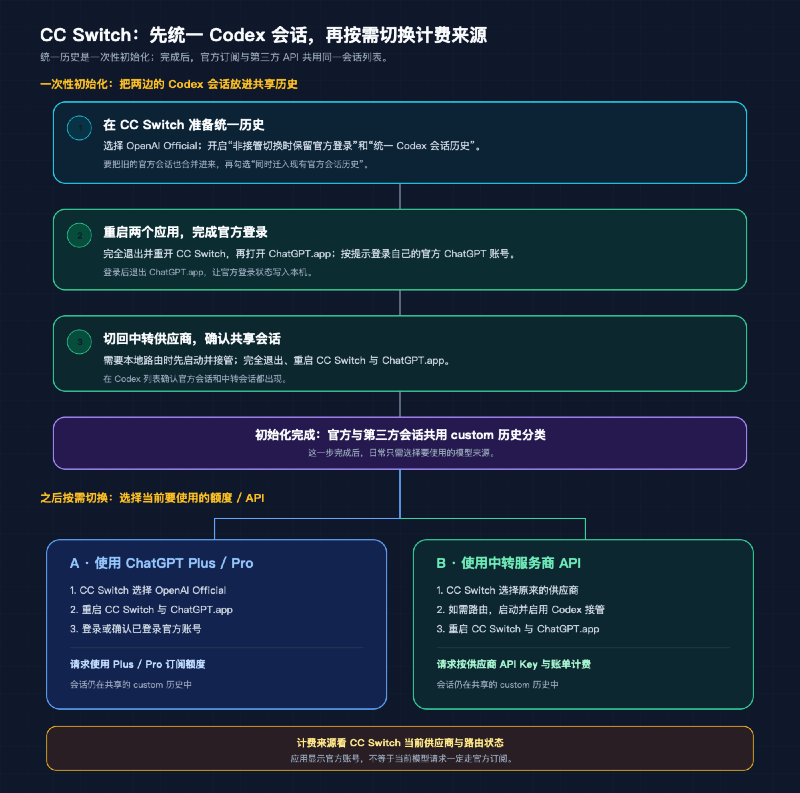
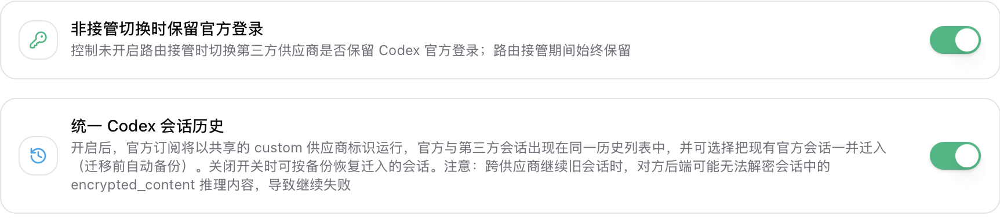
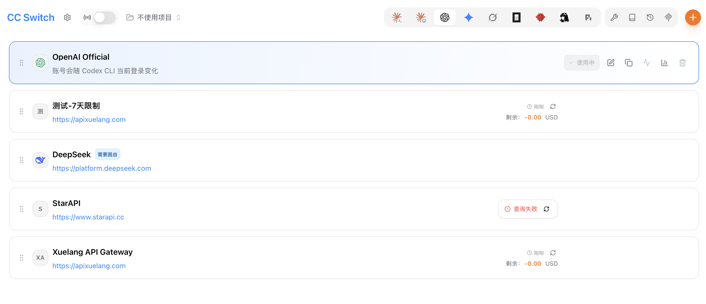

# ChatGPT 注册、订阅与桌面应用使用指南

> 内容类型：使用指南 / 公开资料整理与个人经验  
> 最近核对：2026-09-28（登录与验证方式；CC Switch 部分截至 2026-09-24）  
> 适用平台：ChatGPT 网页版、macOS / Windows 桌面版、Codex、CC Switch  
> 信息状态：OpenAI 与 CC Switch 官方资料整理；招商银行 Visa 付款、登录验证体验及下述切换顺序为我的个人反馈

## 内容简介

本文说明 ChatGPT 账号注册、手机号验证、订阅付款，以及在桌面版使用 Codex 的几种方式。也整理了 CC Switch 接入第三方 API 后如何保留官方登录，以及从第三方供应商切回 OpenAI 官方时，如何查看本机 Codex 历史。

先区分几个名字：ChatGPT 网页和应用中的 **Chat** 是普通对话；新版桌面应用还包括 **Work** 和 **Codex**。Codex 是本地编程代理，有自己的会话历史。ChatGPT 订阅、OpenAI API 余额、第三方 API 供应商的余额分别计费，不能相互替代。

## 1. 网页版与桌面应用的登录验证

从 [ChatGPT 官方网站](https://chatgpt.com/) 登录时，我使用邮箱验证，网页端没有要求手机号。OpenAI 的帮助说明也称，创建账号或使用 ChatGPT 通常不需要手机号；但使用 ChatGPT 桌面应用中的 Codex 时，可能会遇到单独的手机号验证页面。



图中是我在应用登录流程中遇到的“电话号码是必填项”页面。官方说明称，出现这项 Codex 手机号验证时，邮箱或身份验证器应用不能替代该手机号步骤。下面记录的是我随后在网页账户安全设置中尝试其他登录方式的个人经历，不代表 OpenAI 官方承诺的通用绕过方法。

### 通过网页版账户安全设置尝试其他登录方式

登录 ChatGPT 网页版后，进入 **设置 → 账户安全与登录**，可以管理身份验证器应用、短信和“通行密钥和安全密钥”等方式。我分别尝试了身份验证器应用和通行密钥 / 安全密钥。

#### 身份验证器应用

我启用身份验证器应用后，第一次及随后一段时间仍通过邮箱完成登录。清除登录信息、再次登录时，页面询问我是否仍能访问多因素身份验证方式，并提示邮箱验证码将不能再作为备用 MFA 方式；如果失去其他验证方式，可能无法登录账户。



这次提示不代表身份验证器应用方式不可用。我没有找到愿意长期使用的免费验证器：找到的部分应用只有首月免费，之后收费；我不想为此付费，因此移除了身份验证器。是否收费取决于具体应用，配置前应确认自己能长期访问该验证器，并保存好可用的恢复方式。

#### 通行密钥和安全密钥

移除身份验证器后，我在网页版账户安全设置中添加了“通行密钥和安全密钥”。截图显示该项已有 1 个密钥，身份验证器和短信验证均未开启。



我的体验是：改用这一方式后，应用版登录仍从邮箱开始，当前没有再出现上图所示的“邮箱验证码不能作为备用 MFA”提示，也没有再遇到原先的手机号必填页面。这只是我截至 **2026-09-28** 的个人观察；账户类型、设备、地区和登录风险检查可能影响验证流程，不能保证其他账号也会得到相同结果。OpenAI 官方说明确认通行密钥可用于登录或作为 MFA，但没有承诺它会在所有情况下取代桌面应用触发的手机号验证。

如果选择此方式，先在网页版添加并实际确认自己能使用该密钥，再退出其他会话；确认账户仍有自己可用的恢复途径。不要在唯一验证方法不可用时继续清除登录信息。

### 如果页面仍要求手机号

如果账号没有出现上述个人实测的登录流程，或仍显示手机号必填，请按页面提供的方式操作。OpenAI 当前说明为短信；部分地区可能提供 WhatsApp。若使用服务的地区受支持，但号码无法验证，可查看官方帮助或联系官方支持，不要反复把验证码交给第三方代收。

是否能使用服务还受 OpenAI 当前支持的国家和地区限制。先核对 [ChatGPT 支持地区列表](https://help.openai.com/en/articles/7947663-chatgpt-supported-countries)；OpenAI 提醒，从不支持的地区访问可能导致账号被封锁或暂停。手机号来自某个地区，并不等于从不支持地区访问服务就会变成受支持访问。

### 关于接码平台和自己持有的外国号码

网上视频里常见的临时接码平台号码由平台或其他客户控制，号码可能被重复分配；使用者未必能在以后找回账号时再次收到验证码。它也不保证一定能通过 OpenAI 的验证。基于账号安全，不建议把账号绑定到自己无法长期控制的号码，也不要把账号密码、验证码或登录令牌交给代注册服务。

如果你已有自己长期持有、能持续接收短信的境外号码，并且使用服务的地区受 OpenAI 支持，可以按页面要求尝试；是否可用以页面和官方支持为准。不要仅为了注册而购买来历不明的号码。OpenAI API 平台创建第一把 API Key 也可能要求手机号验证；如果不打算使用 Codex 桌面功能或创建 API Key，通常没有必要预先寻找手机号。

## 2. ChatGPT 订阅和付款

### 订阅入口

在 ChatGPT 官方网站登录后，从账号设置进入订阅或账单页面，查看当前可购买的方案和结账金额。方案名称、价格、额度和地区支持可能变化，以下单页面显示为准。网页版订阅通常支持信用卡或借记卡；iOS / Android 应用内订阅则分别由 Apple App Store 或 Google Play 管理，显示当地货币。

我曾用**招商银行发行的 Visa 卡成功支付 ChatGPT 订阅**，同一张 Visa 也用于购买 DLsite 点数。这只代表我当时的付款结果，不保证其他卡、其他银行或之后的交易一定成功。遇到拒付时，先核对发卡行的境外线上交易设置、银行验证提示和结账页面要求；不要把卡号或验证码发给代付者。

### Google Play 订阅与地区价格

[OpenTheRank](https://opentherank.com/zh/) 可以查看多个地区的 ChatGPT 价格。下图是我提供的价格快照：美国 Plus 标价约 **19.99 美元 / 月**，页面列出的各州销售税为 0–10%；按 10% 粗略计算约为 **21.99 美元（约 22 美元）**。



YouTube 上有一则第三方教程演示切换 VPN 出口 IP、准备对应地区地址并尝试更改 Google Play 付款地区，以当地价格订阅；详见 YouTube@傅云飞飞。本文只概述该教程的操作思路，具体规则以 Google Play 官方信息为准。Google Play 要求设置新国家/地区时人需要实际位于该地，并持有该地区的付款方式；购买出错时，Google 也要求 Play 国家/地区与居住国家/地区一致。单靠更换 IP 和填写生成地址并不满足这些条件，可能导致付款失败或账户地区设置受限，因此不要用虚构地址申报居住地或账单地址。

如果你确实迁居到其他国家/地区，可按 [Google Play 官方国家/地区变更说明](https://support.google.com/googleplay/answer/7431675?hl=zh-CN)更新资料。Google 目前说明更改国家/地区后通常至少 90 天才能再次更改，账户资料更新最多可能需要 48 小时；地区变化还可能影响 Play 余额、积分、应用和订阅。

网页银行卡付款可能因发卡行、卡片或结账渠道而失败。如果 Play 国家/地区与我的实际居住地一致，且我有当地可用的付款方式，网页付款失败时我会优先在手机上的官方 ChatGPT Android 应用查看 Google Play 订阅选项。它是另一种付款渠道，不保证一定通过，也不改变当地价格、资格和税费规则。付款前核对最终金额、续费周期，并在对应平台管理或取消订阅。

### 避免重复订阅

订阅在哪个平台购买，就由哪个平台管理：网页版在 ChatGPT 账单设置管理，Apple 或 Google 订阅在相应商店管理。换平台前先检查旧订阅是否仍在续费；卸载应用不会取消商店订阅。ChatGPT 订阅也不包含 OpenAI API 按量费用，API 需要在 API 平台单独开通和结算。

## 3. 使用 CC Switch 接入第三方模型

CC Switch 是管理 Codex 等编程工具配置的免费开源软件。只从 [CC Switch 官方网站](https://ccswitch.io/) 或 [GitHub Releases](https://github.com/farion1231/cc-switch/releases) 获取；CC Switch 不向用户收费。第三方供应商需要单独注册、购买或充值，并自行提供 API Key。模型请求按所选供应商的价格、限额和数据政策处理，**不属于 ChatGPT Plus / Pro 订阅**。

基本流程是：

1. 在 CC Switch 顶部切到 Codex，添加供应商。能用预设时优先选预设，再按供应商说明填写 API Key。
2. 如果上游支持 Codex 使用的 Responses API，可按预设直连；如果只支持 Chat Completions，按 CC Switch 说明启用本地路由和 Codex 接管，让 CC Switch 做协议转换。
3. 启用供应商后完全退出并重启 Codex，再发一条短请求确认模型、路由和供应商计费均正确。

### 不登录官方账号能否直接用桌面版？

CC Switch 的第三方路由不能替代 ChatGPT 账号登录，也不会给你 ChatGPT 订阅。CC Switch 当前的 Codex 桌面端指南指出，桌面模型选择器会检查官方登录态；没有官方登录态时，第三方自定义模型可能不显示。因此，旧文里“本地路由可以直接跳过 Codex 登录”不能当作当前桌面版的稳定保证。

完成一次官方登录后，CC Switch 可以保留官方登录缓存，同时让模型请求走第三方供应商。新版设置里对应的开关叫 **非接管切换时保留官方登录**；旧版指南里可能仍称“切换第三方时保留官方登录”。按当前界面说明，本地路由接管期间始终保留官方登录。Free 账号即可满足 CC Switch 指南所述的登录态用途，但仍须能完成官方登录和页面要求的验证。

如果无法完成官方登录，CC Switch 不能替你绕过手机号验证。Codex CLI 对自定义供应商的支持与桌面 GUI 不完全相同，命令行可能识别配置里的自定义模型；新安装环境仍可能出现首次启动登录提示。因此，第三方 API 是独立于 ChatGPT 付费订阅的使用路线，但不能保证在没有官方登录的情况下完整使用新版桌面 GUI。

### 从旧 CC Switch 说明迁移时要留意

你提供的旧文档里，本地路由、第三方 API 和凭据来源的排查思路仍有参考价值，但配置细节已变化。当前 CC Switch 版本对 Codex 第三方供应商采用新的配置写入方式；不要照旧文把第三方 Key 手动写入或覆盖 `~/.codex/auth.json`。该文件可能含官方登录令牌，不要复制、截图公开或发送给他人。

如果遇到 401，先在 CC Switch 中核对当前 Codex 供应商、上游 API Key、端点和协议设置；再私下检查是否有旧的全局 `OPENAI_API_KEY` 环境变量影响当前工具。不要把完整 API Key、`auth.json`、验证码或未脱敏日志贴到公开 issue。只有确认环境变量与当前供应商冲突时，才按自己的配置删除旧值并重启应用。

## 5. 从第三方供应商切回官方，并查看 Codex 历史

要让官方与中转供应商的 Codex 会话进入同一列表，先开启并配合使用下面两个功能：



这张图把操作拆成两段：先做一次统一历史初始化；以后再按当前需求切换官方订阅或中转 API。

- **非接管切换时保留官方登录**：保留 `auth.json` 中的官方登录态。CC Switch 当前说明是：本地路由未接管时，这个开关控制切换第三方是否保留官方登录；开启本地路由接管时则始终保留。
- **统一 Codex 会话历史**：把官方 Codex 会话也放进第三方共用的 `custom` 历史分类；可选迁入旧的官方会话，并在迁移前备份。它改变的是会话分类，不会替你登录，也不会改写 `auth.json`。



图中两个开关都已开启。开启统一历史时，如果还要把此前的官方会话合并进来，在确认窗口额外勾选“同时迁入现有官方会话历史”；不同版本的文字或布局可能略有变化。

两者配合后，官方登录身份仍在 `auth.json`，而当前模型供应商和历史分类由 `config.toml` 等 Codex 状态决定。CC Switch 当前版本采用 config-only 的第三方凭据写入方式：非接管的第三方配置会把 Key 放在对应 provider 配置中；本地路由接管时，实时配置还会按接管模式写入。具体布局会随版本和路由模式不同，所以不要把旧文档中的字段或 `PROXY_MANAGED` 示例当成固定格式。

还有一个容易混淆的点：`auth.json` 保存官方登录凭据，可能包含访问令牌；`config.toml` 才记录当前模型、provider 和路由配置。`model_provider = "custom"` 应在 `config.toml` / 会话索引一侧检查，不是在 `auth.json` 里找。两个文件都可能含敏感数据，不要把文件内容发到论坛、Issue 或聊天里。

### 两个文件的默认位置

`auth.json` 和 `config.toml` 通常放在当前用户主目录下的 `.codex` 文件夹中：

| 系统 | Codex 配置目录 | `auth.json` | `config.toml` | 打开目录 |
| --- | --- | --- | --- | --- |
| macOS | `~/.codex/`，通常展开为 `/Users/<用户名>/.codex/` | `~/.codex/auth.json` | `~/.codex/config.toml` | Finder 按 `Shift + Command + G`，输入 `~/.codex` |
| Windows | `%USERPROFILE%\.codex\`，通常类似 `C:\Users\<用户名>\.codex\` | `%USERPROFILE%\.codex\auth.json` | `%USERPROFILE%\.codex\config.toml` | 在文件资源管理器地址栏输入 `%USERPROFILE%\.codex` |

macOS 的 `.codex` 是点号开头的隐藏目录，用 Finder 的“前往文件夹”打开最方便。上表是**默认的用户级目录**：如果在 CC Switch 中改过 Codex“配置文件目录”，应以 CC Switch 当前指向的目录为准。若设置过 `CODEX_HOME`，要确认 Codex 实际使用的目录与 CC Switch 配置目录一致；CC Switch 不会自动跟随这个环境变量。目录不一致时，切换供应商和查看历史可能会落在不同位置。

这里只建议定位文件，并在本机查看 `config.toml` 的 `model_provider` 和 `[model_providers.*]` 段。不要公开 `auth.json` 内容，也不要将示例配置整段复制覆盖自己的文件。开启统一历史并选中官方供应商时，CC Switch 当前指南描述的 live 配置大致如下；这只是识别用的示意：

```toml
model_provider = "custom"

[model_providers.custom]
name = "OpenAI"
requires_openai_auth = true
wire_api = "responses"
```

这时 `custom` 是共享历史分类，`requires_openai_auth = true` 表示认证仍使用 `auth.json` 的官方登录。选中第三方供应商后，同一个 `custom` 分类会对应当前第三方配置。CC Switch v3.20.4 起，第三方 Key 不再写入 `auth.json`；正常配置下它进入 provider 配置中的 `experimental_bearer_token`。本地路由接管时则以 CC Switch 的供应商配置和接管状态为准。

### 开启统一历史

1. 先更新到 [CC Switch 最新发布版](https://github.com/farion1231/cc-switch/releases)，完全退出 ChatGPT 桌面应用，并确认 CC Switch 指向的 Codex 配置目录就是桌面应用正在使用的目录。切换前可在本机备份 `config.toml` 和 `auth.json`；备份不要上传或分享。
2. 在 CC Switch 的 Codex 面板切换到 **OpenAI Official**。进入 **设置 → 通用 → Codex 应用增强**，开启 **非接管切换时保留官方登录** 和 **统一 Codex 会话历史**。如果本地路由已接管，前一个开关按当前界面说明会始终保留官方登录。
3. 开启统一历史时，只有想把**此前的官方会话**也放入共享列表，才勾选 **同时迁入现有官方会话历史**。迁移会自动备份。由 CC Switch / Codex 在本机创建的第三方会话通常已经在 `custom` 分类，不靠这个复选框导入。
4. 完全退出并重开 CC Switch，再打开 ChatGPT 桌面应用。如果应用提示登录，完成自己的官方账号登录；确认登录完成后退出 ChatGPT 桌面应用，让登录状态写入本机。
5. 在 CC Switch 切回之前使用的中转供应商。若该供应商需要本地路由，确认路由已启动且 Codex 已接管。完全退出并重开 CC Switch，再打开 ChatGPT 桌面应用，让新配置生效。
6. 在 Codex 视图检查会话列表。统一历史开启时，官方订阅也使用 `custom` 分类；切回第三方后，官方登录态仍可留在 `auth.json`，实际模型请求则按当前第三方供应商配置路由和计费。

按上述步骤完成初始化并确认两种来源的会话都进入同一历史列表后，**官方订阅和第三方 API 就可以随时切换**，统一历史开关保持开启即可。你说明的初始化流程负责统一会话；下面第一种操作是切到 ChatGPT 官方订阅额度，第二种是切到中转服务商 API：



图中蓝色高亮卡片表示当前启用的供应商。切到 **OpenAI Official** 使用 ChatGPT Plus / Pro 订阅额度；切到 **DeepSeek** 等第三方卡片则按对应 API Key 和供应商规则计费。卡片名称和排列以你自己的 CC Switch 配置为准。

- **使用 ChatGPT Plus / Pro 订阅额度**：在 CC Switch 选择 **OpenAI Official**，完全退出并重启 CC Switch 与 ChatGPT 桌面应用，然后登录或确认已登录自己的官方 ChatGPT 账号。确认当前供应商是 OpenAI Official 后，Codex 模型请求走官方后端，消耗对应 Plus / Pro 订阅额度；会话仍使用共享的 `custom` 分类。
- **使用中转服务商 API**：在 CC Switch 选择原来的第三方供应商；若卡片标有需要路由，就启动本地路由并启用 Codex 接管。完全退出并重启两个应用后，请求按该供应商的 API Key、余额和计费规则处理。官方登录态仍可保留在 `auth.json`，但这不代表模型请求正在使用 OpenAI 订阅额度。

判断当前由谁计费，要看 CC Switch 当前启用的 Codex 供应商和路由状态，不能只看 ChatGPT 桌面应用里显示的登录账号。CC Switch 官方说明，“统一历史”只把官方运行映射到共享 `custom` provider 分类，认证仍走 `auth.json` 中的官方登录；第三方和官方模型的计费路径仍由当前供应商决定。

该设置是本机历史归类与可选迁移，不是账号间的云端同步。第三方对话必须已经存在于这台机器、且处于该 Codex 配置目录的会话历史中；如果对话只保存在某个中转站网页或其他应用里，CC Switch 无法把它导入。

### 切回后仍看不到会话，或提示 `Model provider ... not found`

先完全退出 ChatGPT 桌面应用，再在 CC Switch 选择创建该会话时使用的供应商，重新打开应用确认会话文件仍可见。中转服务会话通常属于 `custom`；官方会话通常属于内置的 `openai`。如果还看不到，依次确认：

1. CC Switch 和 ChatGPT 桌面应用使用同一个 Codex 配置目录。
2. `auth.json` 仍有官方登录态。只检查文件是否存在和应用是否显示已登录，不要复制或公开其中的令牌。
3. `config.toml` 的当前 provider 与所选供应商相符；开启统一历史时，官方运行应使用共享的 `custom` 分类。不要手动把整个配置文件改成网上示例。
4. 退出桌面应用后重新切换一次 provider，再启动应用，确认切换时没有数据库占用或写入警告。

截至 2026-09-24，CC Switch 最新发布版为 v3.20.4。Issue [#7362](https://github.com/farion1231/cc-switch/issues/7362) 记录的是 provider 标签不一致时，旧会话仍指向旧 `model_provider`、因而提示 `custom not found` 的故障；关联修复 PR [#7469](https://github.com/farion1231/cc-switch/pull/7469) 尚未合并。按上面的流程开启统一历史后，官方运行也使用 `custom`，这是正常切换两种计费来源时保持同一历史分类的路径。若开关未生效、配置没有注入 `custom`，或旧索引已经和当前 provider 不一致，仍可能遇到 Issue 中的故障：先切回创建该会话的原供应商恢复可见性，再检查开关、配置目录和 CC Switch 提示；不要自行运行 Issue 里的数据库 SQL，也不要手改 `state_5.sqlite`。

### “能看见”不等于“能无缝续聊”

Codex 会话可能包含只有原服务端能解密的推理内容。跨供应商继续旧会话仍可能失败；若使用手机 Remote，也单独核对手机端列表。先备份，再用一条不重要的旧会话验证列表和续聊。重要对话建议先在原供应商中整理成普通文本摘要，切换后开新会话粘贴摘要；不要把“统一历史”理解成模型上下文或远端会话迁移。

如果关闭统一历史，设置弹窗可能提供按备份还原迁入的官方会话。操作前阅读弹窗并保留备份，不要手动编辑 `state_5.sqlite` 或会话 JSONL 文件。

## 注意事项

- OpenAI 支持地区、手机号验证流程、订阅价格和付款选项会变化；付款前以 OpenAI 官方页面和结账页面为准。
- ChatGPT / Work / Codex 的功能和历史范围不同；CC Switch 主要管理本机 Codex 配置，不会把普通 ChatGPT Chat 的模型路由切到第三方。
- 中转服务会接触你提交的提示词和文件内容。选择服务前了解其日志、留存、转发和退款政策，不要发送密码、私钥、访问令牌或敏感文件。
- 不要分享 ChatGPT 登录令牌、`~/.codex/auth.json`、第三方 API Key、验证码或包含这些信息的日志。

## 来源

- [OpenAI：手机号验证说明](https://help.openai.com/en/articles/8983040-what-does-phone-verification-look-like)
- [OpenAI：账户多因素身份验证（MFA）](https://help.openai.com/en/articles/7967234-managing-multi-factor-authentication-mfa)
- [OpenAI：使用通行密钥保护账户](https://help.openai.com/en/articles/20001039-passkeys-to-secure-your-openai-account)
- [OpenAI：ChatGPT 支持国家和地区](https://help.openai.com/en/articles/7947663-chatgpt-supported-countries)
- [OpenAI：多币种账单与付款方式](https://help.openai.com/en/articles/10421635-multicurrency-billing)
- [OpenAI：跨平台订阅及避免重复扣费](https://help.openai.com/en/articles/20001043-how-do-i-avoid-being-charged-twice-if-i-subscribe-to-chatgpt-on-ios-android-and-the-web)
- [Google Play：更改 Google Play 国家/地区](https://support.google.com/googleplay/answer/7431675?hl=zh-CN)
- [OpenTheRank：ChatGPT 地区价格](https://opentherank.com/zh/)
- [OpenAI：迁移到新版 ChatGPT 桌面应用](https://help.openai.com/en/articles/20001276-moving-to-the-new-chatgpt-desktop-app)
- [CC Switch：发布与更新公告](https://github.com/farion1231/cc-switch/releases)
- [CC Switch：v3.20.4 发布说明](https://github.com/farion1231/cc-switch/blob/main/docs/release-notes/v3.20.4-zh.md)
- [CC Switch：Codex 配置目录和 `CODEX_HOME` 注意事项](https://github.com/farion1231/cc-switch/blob/main/docs/release-notes/v3.19.1-zh.md)
- [CC Switch：设置与 Codex 配置目录](https://github.com/farion1231/cc-switch/blob/main/docs/user-manual/zh/1-getting-started/1.5-settings.md)
- [CC Switch：统一 Codex 会话历史指南](https://github.com/farion1231/cc-switch/blob/main/docs/guides/codex-unified-session-history-guide-zh.md)
- [CC Switch：使用第三方 API 时保留官方登录](https://github.com/farion1231/cc-switch/blob/main/docs/guides/codex-official-auth-preservation-guide-zh.md)
- [CC Switch：桌面应用自定义模型显示说明](https://github.com/farion1231/cc-switch/blob/main/docs/guides/codex-desktop-custom-model-visibility-zh.md)
- [CC Switch：切换供应商后历史会话无法打开的问题跟踪](https://github.com/farion1231/cc-switch/issues/7362)
- [CC Switch：历史会话 provider 同步修复 PR（尚未合并时请勿手动套用）](https://github.com/farion1231/cc-switch/pull/7469)
- [CC Switch：统一历史迁移后新会话未进入共享列表的问题跟踪](https://github.com/farion1231/cc-switch/issues/7466)
