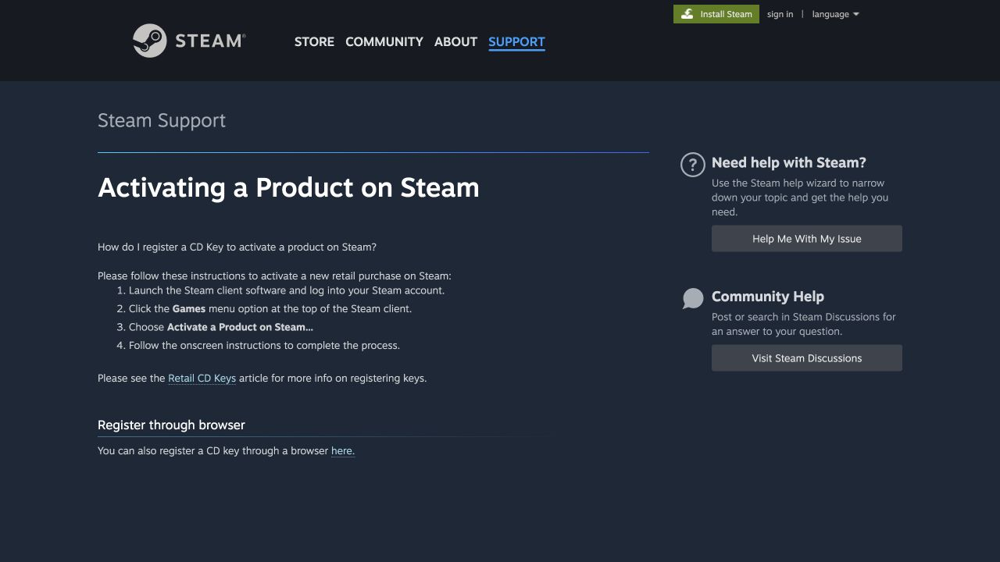
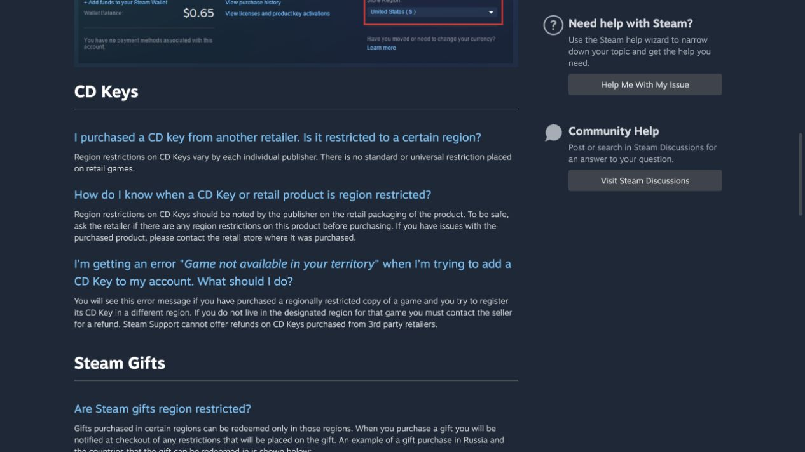
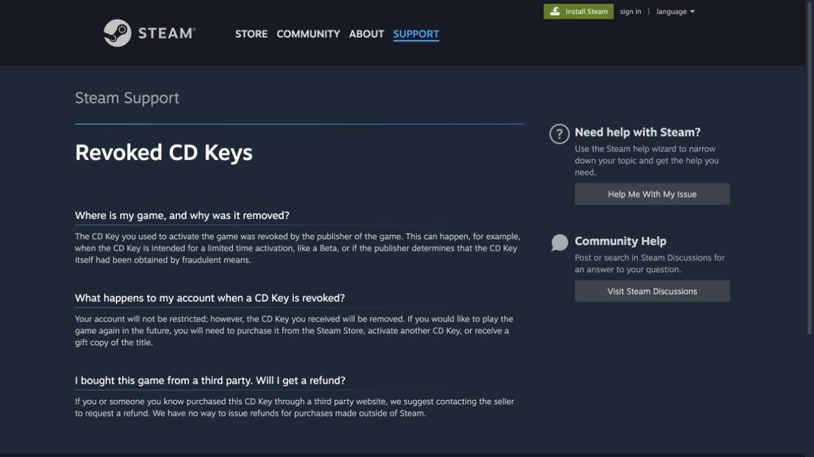
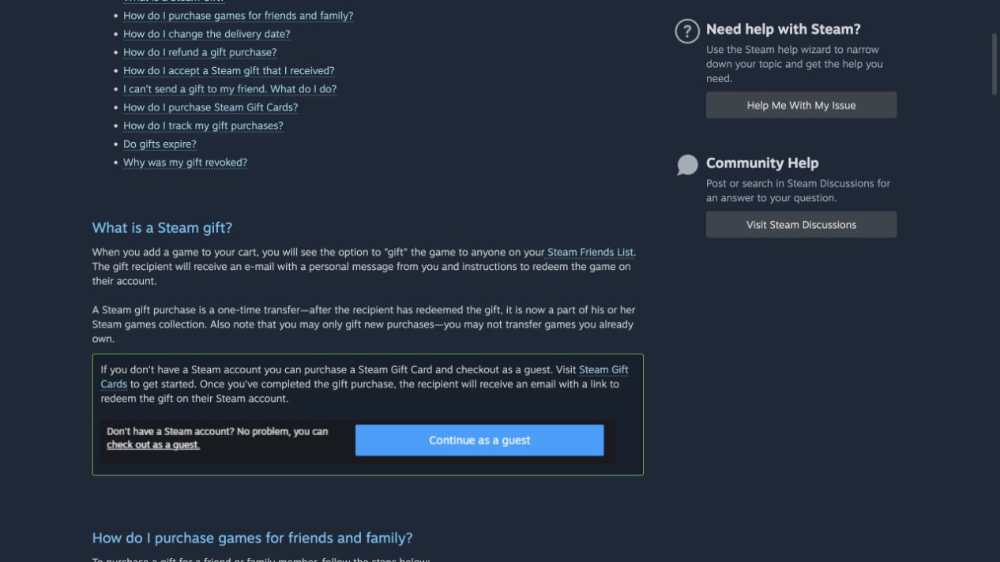
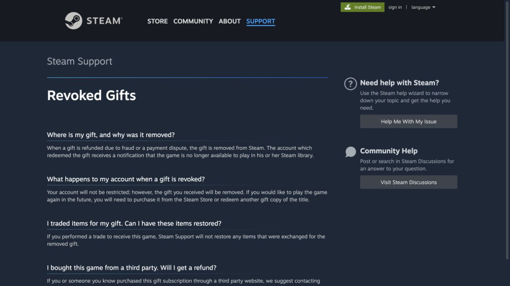

# Steam 游戏购买说明

> 内容类型：知识说明  
> 最近核对：2026-09-24  
> 信息状态：根据 Steam 官方页面整理

这篇文章整理几种常见的 Steam 游戏购买方式：在 Steam 商店直接购买、购买 Steam CD Key、通过 Steam 好友赠送，以及使用 Steam 钱包余额。它们的付款对象、退款渠道和游戏被撤销后的处理方式并不相同。

## 一、Steam 商店直接购买

在 Steam 客户端或网页商店打开游戏页面，选择加入购物车并为自己的账号结账。游戏会直接进入账号游戏库，购买记录也能在 Steam 账户中查询。

Steam 商店购买的游戏通常适用 Steam 退款政策：一般可在购买后 14 天内申请，且游戏时间少于 2 小时；不同商品和特殊情况可能有例外，是否退款以 Steam 页面说明和审核结果为准。参见 [Steam 退款政策](https://store.steampowered.com/steam_refunds)。

## 二、购买 Steam CD Key

CD Key（也常写作 CDK、序列号或产品代码）是用于注册游戏的密钥，不是 Steam 账号，也不是 Steam 钱包余额。发行商会向零售渠道提供部分可在 Steam 激活的密钥；购买前要确认商品明确支持 Steam，而不是其他游戏平台或发行商自己的启动器。

### 如何在 Steam 激活

Steam 客户端中依次选择“游戏”→“在 Steam 上激活产品…”，再按屏幕提示输入密钥。激活前先核对商品平台、游戏版本和适用地区。

图：Steam 官方给出的 CD Key 激活入口和步骤。完整说明见 [Activating a Product on Steam](https://help.steampowered.com/en/faqs/view/2A12-9D79-C3D7-F870)。

### 留意 CD Key 的地区限制

Steam 官方说明，零售 CD Key 的地区限制由各发行商分别设定，并不存在适用于所有游戏的统一规则。页面写着“全球版”“低价区”或卖家口中的“锁区”，都不能代替核对具体密钥的激活地区；购买前应向卖家确认这把 Key 是否能在自己的 Steam 账户地区激活，以及是否有运行地区限制。

图：Steam 提醒玩家，CD Key 的地区规则由发行商决定；若在不适用的地区激活，通常需要联系售卖方处理。完整说明见 [Region Restrictions on Steam](https://help.steampowered.com/en/faqs/view/58D3-B80D-2943-3CC6)。

### 密钥被撤销会怎样

Steam 官方列出的情况包括：密钥只供限时测试等用途，或发行商认定密钥是通过欺诈方式取得。密钥被撤销后，密钥对应的游戏会从账号中移除；Steam 说明这件事本身不会限制账号。若密钥来自第三方网站，Steam 不会为站外购买提供退款，应联系原卖家。

图：Steam Support 将“游戏密钥被撤销”和“账号受限”分开说明，也提醒站外购买的退款要联系卖家。完整说明见 [Revoked CD Keys](https://help.steampowered.com/en/faqs/view/029B-6D58-6EE6-1D7A) 和 [Steam 退款政策](https://store.steampowered.com/steam_refunds)。

买到无效或已被使用的 Key，也应先找出售该 Key 的商家处理；Steam Support 表示无法为零售购买补发密钥，参见 [Retail CD Keys](https://help.steampowered.com/en/faqs/view/0e71-0971-324a-1161)。

## 三、通过 Steam 好友赠送游戏

Steam 商店支持把游戏购买为礼物并送给好友。官方说明是在购物车结账时选择送给 Steam 好友；好友兑换后，游戏就进入收礼人的游戏库。

图：Steam 官方说明好友赠礼的入口，以及礼物兑换后进入收礼人的游戏库。完整说明见 [Steam Gifts](https://help.steampowered.com/en/faqs/view/2C02-3563-B72F-F117)。

如果你先在商家处付款，再由对方加好友送礼，付款关系发生在 Steam 之外；退款和售后要按商家的订单规则处理。下单前先确认礼物是否适用于自己的地区、具体游戏版本和退款条件；不要把 Steam 密码、手机令牌验证码或登录确认交给卖家。

Steam 说明，礼物因欺诈或付款争议被退款时，已兑换的游戏可能从收礼账号中移除；礼物被撤销本身不会限制账号。第三方购买的礼物若被撤回，Steam 不会替第三方卖家退款，应联系卖家处理。

图：Steam 对“礼物被撤回”的解释。礼物撤回与账号限制是两件事；完整说明见 [Revoked Gifts](https://help.steampowered.com/en/faqs/view/558E-7FF0-1C5C-D1EE)。

礼物也可能有地区限制。Steam 商店会在购买时显示适用范围；不要只根据卖家提供的截图或“全球礼物”等说法判断。地区限制页面同时说明，Steam Support 无法修改或移除商品的地区限制，详见 [Region Restrictions on Steam](https://help.steampowered.com/en/faqs/view/58D3-B80D-2943-3CC6)。

## 四、Steam 钱包充值码与余额

Steam 钱包充值码或礼品卡是给账号增加钱包余额，和用于注册某款游戏的 CD Key 不同。余额可用于 Steam 支持的钱包消费，但 Steam 用户协议说明钱包资金没有 Steam 以外的现金价值，不能兑换现金，也不能转让给其他账号；Steam 另有适用的钱包余额退款规则。可查看 [Steam 礼品卡与钱包码](https://store.steampowered.com/digitalgiftcards/selectgiftcard?l=schinese)、[Steam 钱包常见问题](https://help.steampowered.com/en/faqs/view/78E3-7431-1E88-AD59)、[Steam 用户协议](https://store.steampowered.com/subscriber_agreement/?l=schinese)及[钱包余额退款说明](https://store.steampowered.com/steam_refunds)。

因此，“Steam 余额导出”不是 Steam 提供的常规账号功能。Steam 官方数字礼品卡也不能用已有钱包余额购买；向好友赠送数字礼品卡属于单独的商店购买流程，部分地区可能有发送或接收限制。

## “红锁”“黄锁”是什么意思？

“红锁”“黄锁”是玩家或商家使用的俗称，不是 Steam 官方统一定义的分类。不同讨论里它们可能指游戏被撤销、礼物被撤回、地区无法激活、交易或社区功能受限，甚至账号级限制，不能只凭颜色判断实际后果。

遇到问题时先看 Steam 通知具体写了什么：

- 游戏从库中消失：查看是否为 CD Key 或礼物被撤销。
- 显示所在地区不可用：核对游戏、密钥或礼物的地区限制。
- 账号功能受到限制：以 Steam 账户通知为准，并查看 [Restricted Steam Account](https://help.steampowered.com/en/faqs/view/4F62-35F9-F395-5C23)。

单个 CD Key 或礼物被撤回，并不等于账号必然被限制；反过来，也不要把“密钥已成功激活”当成来源可靠或以后不会被撤销的保证。

## 购买前快速核对

- 商品写明的平台是 Steam，且游戏名称、版本和附加内容正确。
- CD Key 确认能在自己的账号地区激活；礼物确认能在自己的地区接收和运行。
- 了解卖家对无效、重复、地区不符或事后撤销的处理方式。
- 优先通过 Steam 商店或可信的正规零售渠道购买；明显低于正常价格时先查清来源。
- 不向商家提供账号密码、令牌验证码、登录确认或远程控制权限。

## 官方资料

- [激活 Steam 产品](https://help.steampowered.com/en/faqs/view/2A12-9D79-C3D7-F870)
- [Steam 零售 CD Key 说明](https://help.steampowered.com/en/faqs/view/0e71-0971-324a-1161)
- [Steam 好友赠礼说明](https://help.steampowered.com/en/faqs/view/2C02-3563-B72F-F117)
- [CD Key 被撤销](https://help.steampowered.com/en/faqs/view/029B-6D58-6EE6-1D7A)
- [礼物被撤回](https://help.steampowered.com/en/faqs/view/558E-7FF0-1C5C-D1EE)
- [Steam 地区限制](https://help.steampowered.com/en/faqs/view/58D3-B80D-2943-3CC6)
- [Steam 账户限制](https://help.steampowered.com/en/faqs/view/4F62-35F9-F395-5C23)
- [Steam 退款政策](https://store.steampowered.com/steam_refunds)
- [Steam 钱包常见问题](https://help.steampowered.com/en/faqs/view/78E3-7431-1E88-AD59)
- [Steam 礼品卡与钱包码](https://store.steampowered.com/digitalgiftcards/selectgiftcard?l=schinese)
- [Steam 用户协议：Steam 钱包](https://store.steampowered.com/subscriber_agreement/?l=schinese)

截图为 Steam Support 页面局部，保留英文原文；配文为中文摘要。官方页面可能更新，遇到问题请以当前页面和账号通知为准。
