# DLsite 游戏购买说明

> 内容类型：购买说明  
> 最近核对：2026-09-28
> 信息状态：公开资料整理；银行卡支付部分依据我的反馈

DLsite 是日本的数字作品销售平台，可以购买游戏、漫画、音声等作品。本文重点说明两种购买方式：先用 BitCash 购买 DLsite 点数，再用点数结账；或在结账时直接使用银行卡。

DLsite 点数自 2025 年 9 月起更名为 viviON 点数。下文为方便查找，会同时使用“DLsite 点数”和“viviON 点数”两个名称。官方说明的兑换比例是 1 点等于 1 日元。

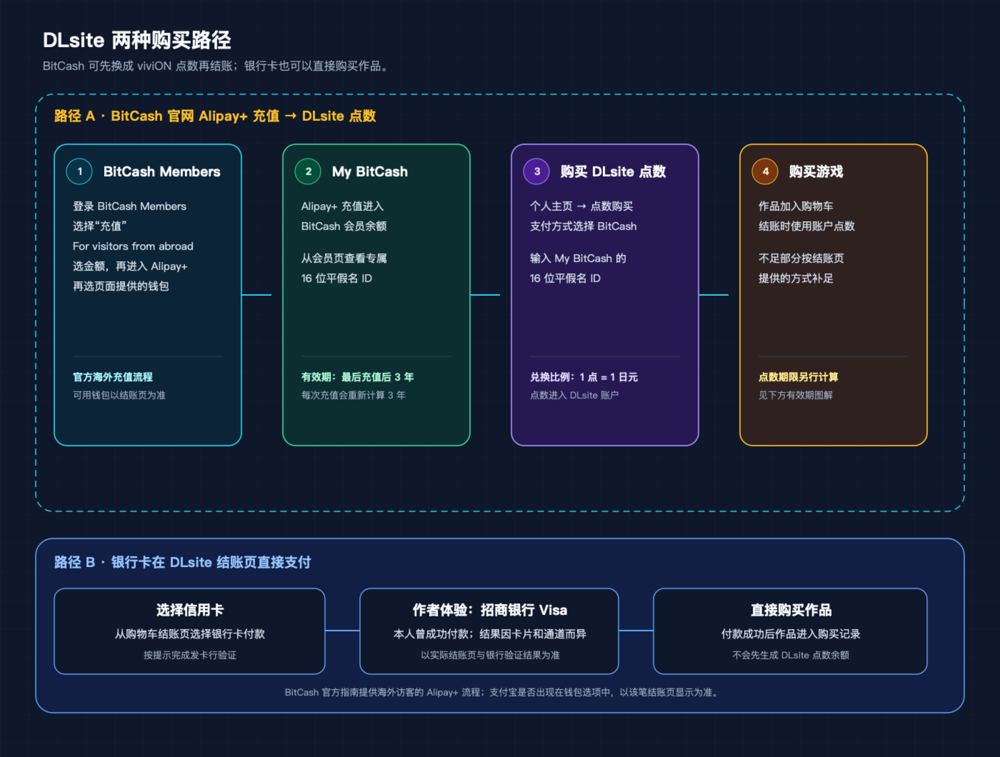

## 付款方式速览

| 方式 | 怎么付款 | 主要注意事项 |
| --- | --- | --- |
| BitCash 购买点数 | 可通过 BitCash 官网的海外访客 Alipay+ 流程给 My BitCash 充值，再从 DLsite 点数页面购买点数并结账 | My BitCash 和 DLsite 账户点数是两种余额，有各自有效期；具体可选钱包以 BitCash 结账页为准 |
| 银行卡直接支付 | 在 DLsite 购物车结账时选择信用卡 | 我曾用招商银行 Visa 卡在 DLsite 成功支付；银行卡、账号和支付通道的结果可能不同 |

## 一、用 BitCash 购买 DLsite 点数

BitCash 是以日元计价的预付电子货币。通常 1 BitCash credit 对应 1 日元。DLsite 的官方说明将 BitCash 列为“购买点数”的支付方式；它不是直接为购物车里的游戏付款，而是先把 BitCash 余额换成 DLsite / viviON 账户点数。

### 购买流程总览

1. 如果使用官网线上充值，先登录或注册 BitCash Members，在会员页进入“充值”。
2. 选择 **For visitors from abroad** 和充值金额，再按页面提示选择 Alipay+ 与可用电子钱包。使用实体券码时，则先确认券种、面额和有效期。
3. 回到 DLsite 个人主页的“购买点数”页面，选择点数金额和 BitCash 支付方式。
4. 按页面提示输入 My BitCash 或券码的 16 位平假名 ID 并完成支付。成功后点数进入当前 DLsite / viviON 账户。
5. 将作品加入购物车并结账，在点数栏选择使用全部点数或输入部分点数；不足的金额再用结账页提供的其他方式支付。

BitCash ID 是 16 个平假名组成的预付码。不要把它发给商家以外的人，也不要把 DLsite 或 BitCash 密码交给代购者。

### 第一步：通过 Alipay+ 给 My BitCash 充值

BitCash Members 的充值页提供 **For visitors from abroad** 入口。登录后选择该入口和充值金额，再按页面提示使用 **Alipay+** 完成付款；金额会进入当前登录账号的 My BitCash 余额。BitCash 的[海外访客充值指南](https://bitcash.jp/docs/guide/lang/id/chargeDl)列出了这一流程。

支付宝与 Alipay+ 是不同的服务：Alipay+ 是跨境支付网关，其[官方钱包列表](https://www.alipayplus.com/cn/faq/)列有支付宝（中国大陆）钱包。实际可选的钱包、汇率和手续费以 BitCash 当次显示的支付页面为准。

#### 充值页面操作

1. 登录 BitCash Members，打开“充值”，在“其他”区域选择 **For visitors from abroad**。

   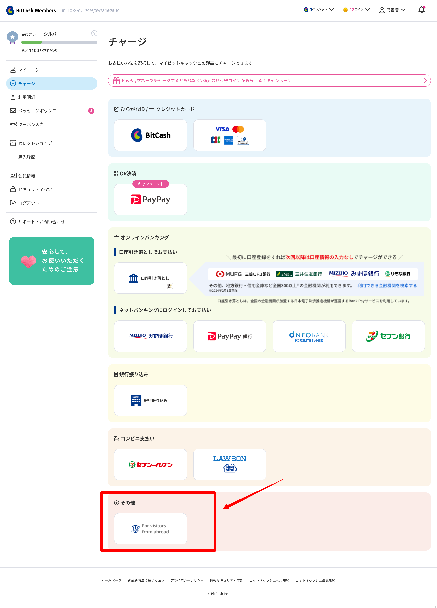

2. 选择充值金额并继续。页面会显示可选金额和当时适用的充值上限；以实际页面为准。

   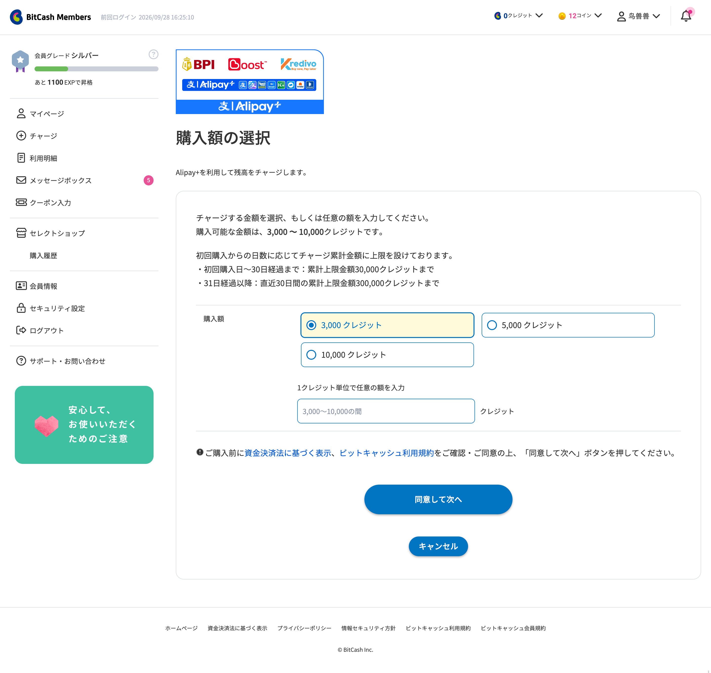

3. 在付款弹窗确认金额。截图中的“姓名”旁标注“任意”，是可选信息，可以留空；它不是 BitCash 充值账号。这里不用填写昵称、登录 ID 或 My BitCash 平假名 ID。付款成功后，金额会充入当前登录的 My BitCash。

   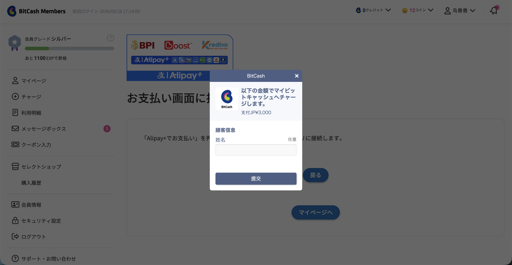

4. 返回 BitCash Members 个人主页查看余额。My BitCash 平假名 ID 是之后在 DLsite 等商家付款时使用的专用 ID；公开分享页面时不要展示完整 ID。

   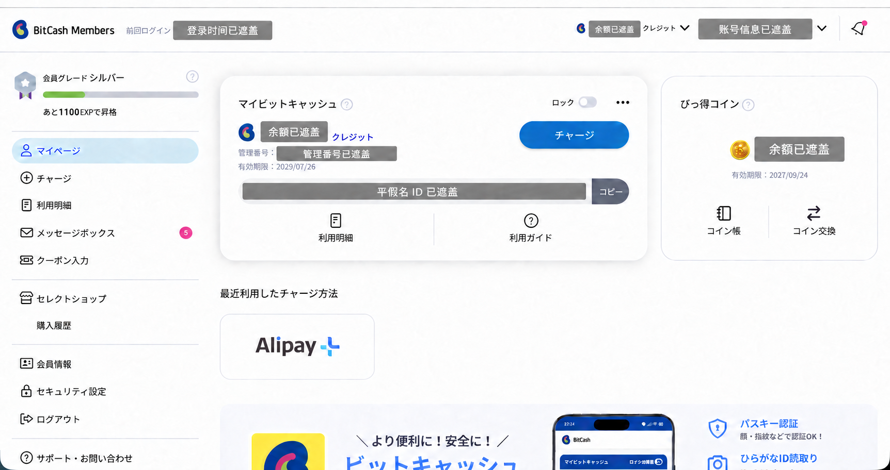

### 第二步：用 My BitCash 购买 DLsite 点数

1. 登录 DLsite，进入个人主页的“点数 → 购买点数”，选择 **BitCash** 付款方式，并选择要购买的点数金额。

   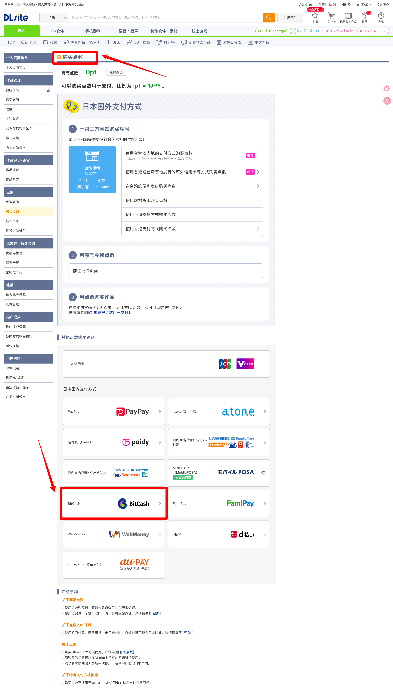

2. 确认购买金额后，DLsite 会打开平假名 ID 输入页面。将 BitCash Members 个人主页显示的 **My BitCash 专用平假名 ID** 输入必填框，再确认购买。该 ID 由 16 个平假名字符组成，输入时不加连字符；不要填写 BitCash 登录 ID 或昵称，也不要照抄截图中的示例占位文字。

   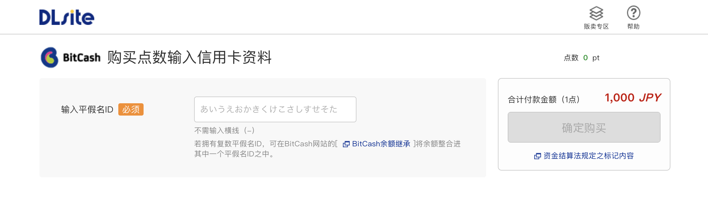

3. 支付成功后，购买的点数会进入当前 DLsite / viviON 账户，可在购买点数或点数履历页面查看。DLsite 点数可用于支付站内作品，通常按 1 点抵 1 日元计算。

#### 平假名 ID 的安全设置

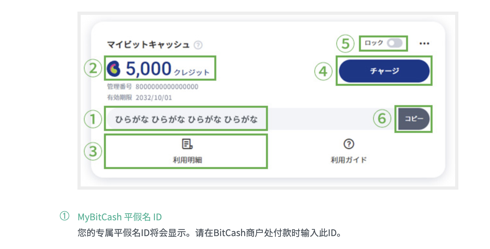

图中的⑤是 My BitCash 的“锁定”开关。若平假名 ID 意外泄露，可先在 My BitCash 页面启用锁定，暂时阻止该 ID 用于付款和充值；再进入 BitCash Members 的“安全设置”更换 My BitCash 平假名 ID。新 ID 由系统分配，不能自行指定；官方说明更换后 24 小时内不能再次更换。解除锁定后再使用新的 ID。详见 BitCash 的[安全设置说明](https://bitcash.jp/docs/support/serviceguide/members/security/index)和[锁定功能说明](https://bitcash.jp/docs/support/faq/m02?sv=1)。

#### 视频内容补充

有一则 B 站实操视频以 Fantia／虎之穴为例，演示通过支付宝购买或充值虎币（TORACOIN）的操作，其中 BitCash 与支付宝充值环节可辅助理解本节流程；详见 B站@万战克里格。虎币不是 DLsite 的 viviON 点数。购买 DLsite 游戏时，按本节先给 My BitCash 充值，再回到 DLsite 购买 viviON 点数。页面名称、支付钱包和操作入口可能随官方改版变化，付款前以当前页面显示为准。

## 二、银行卡直接支付

将作品加入购物车并进入结账页，在“确认购买内容”页面完成优惠券和付款方式的选择：

1. 如果有适用优惠券，在“优惠券”一栏点击“变更”并选择要使用的优惠券。优惠券通常有作品、金额或使用期限等条件，是否可用以页面提示为准。
2. 在“支付方法”一栏点击“变更”，选择 Visa / Mastercard，再点击选择页面中的“决定”返回确认页。

   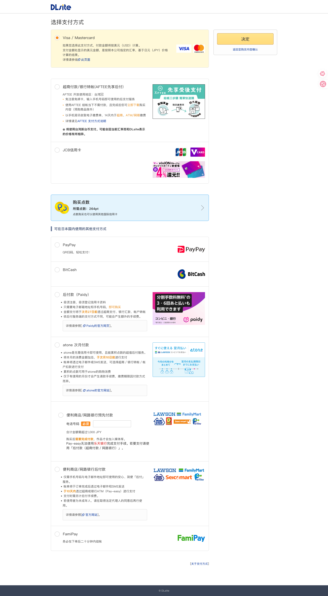

3. 检查购买作品、使用点数、优惠券折扣和合计金额。截图中的优惠券示例将 330 日元小计减免 66 日元；DLsite 会按页面显示的汇率折算美元金额，实际金额以结账页为准。确认无误后点击“确定购买”。

   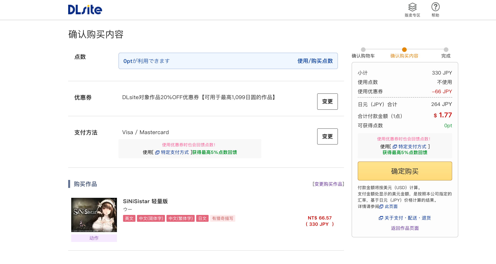

4. 在弹出的信用卡信息窗口填写持卡人本人的卡号、有效期、持卡人姓名、安全码和国家/地区，再按页面提示完成支付及发卡行验证。图中浅灰色文字是输入框占位提示，不是需要照抄的卡片信息。

   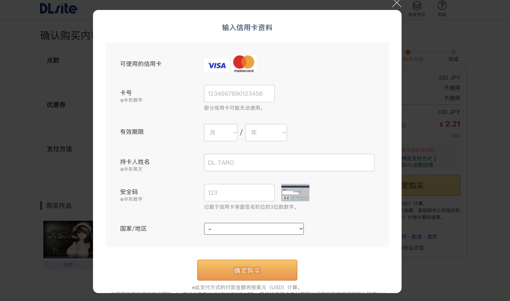

我曾用招商银行发行的 Visa 卡在 DLsite 成功完成直接支付；同一张 Visa 卡也用于 ChatGPT 订阅。

这条反馈只代表我的实际使用经验。DLsite 曾因支付通道调整暂停部分卡组织，后来也公告过海外发行卡的短暂结账故障并说明故障已修复；这些公告都不能保证每张 Visa 卡、每个账户和每笔交易都一定通过。以付款时 DLsite 显示的方式和发卡行验证结果为准。银行卡直接支付也不会先留下 DLsite 点数余额。

## 三、BitCash 与 DLsite 点数的有效期

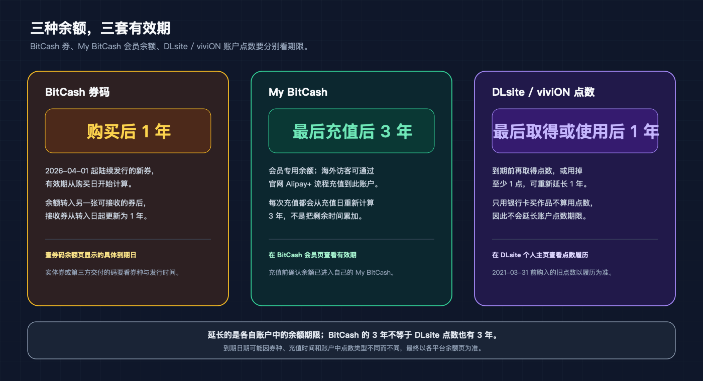

| 余额 | 适用规则 | 延长期限的方法 |
| --- | --- | --- |
| BitCash | 2026 年 4 月 1 日起销售的新 BitCash，通常自购买起 1 年有效；会员专用的 My BitCash 有效期为 3 年 | 新 BitCash 转移余额后，有效期从转入日起更新 1 年；给 My BitCash 充值后，有效期从充值日起更新 3 年 |
| DLsite / viviON 点数 | 最后一次取得点数或使用点数起 1 年后失效 | 在到期前取得点数或使用至少 1 点，账户中有期限的点数可再延长 1 年 |

### BitCash 的有效期怎么查和延长

BitCash 官方从 2026 年 4 月 1 日起销售新券种：店头销售的 BitCash 有效期为 1 年，My BitCash 为 3 年。给 My BitCash 充值会把有效期更新为充值日起 3 年；新 BitCash 之间转移余额，或把旧券余额转入新券，会把接收券的有效期更新为转移日起 1 年。旧券仍可以使用，但剩余期限取决于券的种类和发行时间。

通过官网 Alipay+ 海外访客流程在线充值的是 My BitCash 会员余额，适用 My BitCash 的 3 年期限；它和单独购买的 BitCash 券码有效期不同。每次给 My BitCash 充值后，3 年从最近一次充值日重新计算，不是把剩余期限累加。

拿到 BitCash 码后，可先在 BitCash 官方“残高查询”页面确认种类、余额和到期日。第三方店铺的商品标题可能还保留旧版“10 年有效”的描述；应以该张码的官方查询结果为准。

### DLsite 点数的有效期怎么查和延长

DLsite 官方规则规定，免费点数和购买点数都在最后一次点数使用日或取得日起 1 年后失效。使用 1 点或取得点数，都可以更新账户中有期限点数的到期时间；只用银行卡购买作品而没有使用点数，不会延长点数有效期。可以在 [DLsite 个人主页的点数履历](https://www.dlsite.com/home/mypage/aboutpoint)中查看余额和到期信息。官方 2021 年公告另说明，2021 年 3 月 31 日前购买的点数当时保留无期限；若账户仍有这类旧余额，以点数履历为准。

如果暂时不打算买作品，可在到期前使用少量点数，或通过官方点数页面取得点数来更新期限。不要只因“延长期限”而盲目购买超出需要的点数。

### 官方兑换码还有一层期限

DLsite 授权的 DPay 点数销售网站提供兑换码。DPay 条款另规定，尚未兑换的 DPay 码从购买日起有效 6 个月；兑换成 viviON 点数后，再按 DLsite 账户点数规则管理。这个 6 个月是兑换码的期限，不是 BitCash 或 DLsite 账户点数的期限。

## 四、第三方渠道的规则、价格与风险

### DLsite 对第三方点数渠道的公开规则

DLsite 官方公告和使用条款说明了点数的兑换比例、使用和有效期；条款也禁止用户把账户内的点数转让给第三方。本次核对到的公开资料中，没有找到“所有非官方店铺售出的 DLsite 点数一律禁止使用”这样的统一公告，因此不能把所有第三方卖家直接说成违规或盗刷。

能确认的安全边界是：

- 从 DLsite 登录后的点数购买页面购买，或从 DLsite 明确授权的销售页面购买，更容易核对来源。
- DPay 页面自述其为 DLsite 授权的点数销售服务，并公布了自己的退款和兑换码条款。
- DLsite 点数进入账户后受 DLsite 点数条款约束；账户点数不能在用户之间转让。

第三方卖家提供的 BitCash 码、兑换码或代充服务，其上游来源、退款条件和售后保障要单独核验。若码已被使用、无效、来源存在争议或后续被撤回，买家可能需要向原卖家处理，不能预先假设 DLsite 或 BitCash 一定补发或退款。

若改为在淘宝、京东或闲鱼等店铺购买实体券码或兑换码，那是另一种渠道。BitCash 官方客服明确表示，非授权销售渠道购入的 BitCash 不属于官方客服支持范围。购买第三方码前，至少确认面额、适用服务、交付方式、余额和有效期，并保留订单凭证；卖家自称“官方卡”或“正规渠道”仍需独立核验。

### 国内平台检索与商品页价格抽样

核价日期为 2026 年 9 月 24 日。搜索平台为淘宝、京东和闲鱼，搜索词分别为“dl点数 1000”“DLsite 1000点”和“dl点数 1000”。比较对象统一为 1,000 日元面值：DLsite 点数为 1 点 1 日元，BitCash 为 1 credit 1 日元。以当日公开汇率约 1 日元 = 0.0425 元计算，1,000 日元约合 42.50 元；此数未计发卡行汇兑费用。

只把商品详情或已显示的规格确认页中能确认是 1,000 点或 1,000 日元的报价计入比例，同一平台内同一店铺只计一次。直接点数码、BitCash 码和卖家代充的交付方式不同，表内已注明；BitCash 商品只纳入页面明确列出 DLsite 用途的商品。多面额商品如果详情页只显示价格区间，就在规格确认页选择 1,000 档查看金额；仍无法确认的报价不纳入比例。

比例按选中 SKU 显示的商品价计算。订单确认页如果另显示账号或活动优惠，只记录在说明中，不用于店铺价格比例；实际结算价可能因优惠而变化。

| 平台 | 店铺 / 商品页 | 1,000 点或 1,000 日元标价 | 计入比例 |
| --- | --- | ---: | --- |
| 淘宝 | [快乐de淘屋](https://item.taobao.com/item.htm?id=1001066082067) | ￥45 | 是 |
| 淘宝 | [川岛晚枫数码电玩](https://item.taobao.com/item.htm?id=1052799310649) | ￥48 | 是 |
| 淘宝 | [爱儿堡公主](https://item.taobao.com/item.htm?id=948847486764) | ￥45 | 是 |
| 京东 | [欢乐畅娱电玩游戏专营店](https://item.jd.com/10046167659691.html) | ￥60 | 是 |
| 京东 | [奥兰游戏服务专营店](https://item.jd.com/10042890226758.html) | ￥58 | 是 |
| 京东 | [醒家视频会员专营店](https://item.jd.com/10052966067541.html) | ￥65 | 是 |
| 京东 | [家庭会员拼购店](https://item.jd.com/10221205478194.html) | ￥52 | 是 |
| 京东 | [银狐游戏专营店](https://item.jd.com/10210124207341.html) | ￥50 | 是 |
| 京东 | [蔷栾专营店](https://item.jd.com/10230419136718.html) | ￥50.14 | 是 |
| 京东 | [岑岭专营店](https://item.jd.com/10152436640045.html) | ￥52.50 | 是 |
| 闲鱼 | [田怔国YYDS](https://www.goofish.com/item?id=1063843656080) | ￥43；商品页写明“默认 1000”，为人工代充服务 | 是，按商品页标价计 |
| 闲鱼 | [游戏点卡销售员](https://www.goofish.com/item?id=908953863789) | ￥46；固定 1,000 点 BitCash 卡密 | 是 |
| 闲鱼 | [卖卡小伙子](https://www.goofish.com/item?id=981044576406) | ￥44；规格确认页选中 1,000 点 | 是 |
| 闲鱼 | [日本充值铺](https://www.goofish.com/item?id=793875259967) | ￥44；规格确认页选中 1,000 点 | 是 |
| 闲鱼 | [咕嘎 CDK 卡券](https://www.goofish.com/item?id=1082128640829) | ￥50.80；规格确认页选中 1,000 点（商品起价 ￥12.80） | 是 |
| 闲鱼 | [一如既往](https://www.goofish.com/item?id=1038217084925) | ￥22；规格确认页选中 1,000 点 | 是 |
| 闲鱼 | [那路 SwitchCDK](https://www.goofish.com/item?id=998900720239) | ￥25.80；规格确认页选中 1,000 点 | 是 |
| 闲鱼 | [光盐电玩](https://www.goofish.com/item?id=1078235606192) | ￥25.80；规格确认页选中 1,000 点 | 是 |
| 闲鱼 | [拍下默认已读置顶和简介](https://www.goofish.com/item?id=1073473905858) | ￥47.90；规格确认页选中 1,000 点，DLsite 兑换码 | 是 |

严格样本共 19 个平台店铺页：淘宝 3 个、京东 7 个、闲鱼 9 个。同一平台内同一卖家只计一次。按 1,000 日元约合 ￥42.50 分档，各平台样本比例如下：

| 平台 | 店铺数 | 样本价格区间 | 低于 ￥42.50 | ￥42.50–50.00 | 高于 ￥50.00 |
| --- | ---: | ---: | ---: | ---: | ---: |
| 淘宝 | 3 | ￥45–48 | 0/3（0%） | 3/3（100%） | 0/3（0%） |
| 京东 | 7 | ￥50–65 | 0/7（0%） | 1/7（14.3%） | 6/7（85.7%） |
| 闲鱼 | 9 | ￥22–50.80 | 3/9（33.3%） | 5/9（55.6%） | 1/9（11.1%） |
| 合计 | 19 | ￥22–65 | 3/19（15.8%） | 9/19（47.4%） | 7/19（36.8%） |

卖卡小伙子的商品详情页显示多面额区间；在规格确认页选中 1,000 点后，页面显示 ￥44。咕嘎 CDK 卡券的商品页显示 ￥12.80 起，在规格确认页选中 1,000 点后显示 ￥50.80；同一卖家的另一条商品选中 1,000 点显示 ￥50.90，本表按一个卖家只计一次。￥26.80 是该商品的起价，不是 1,000 点档价格。光盐电玩的商品确认页还有订单优惠，因此比例仍按商品 SKU 标价 ￥25.80 统计。新加入的兑换码商品页面标价区间很宽，选择 1,000 点后确认页显示 ￥47.90；卖家称兑换码为官网购入，此说法未经独立核实。另有一条标价 ￥26.60 的多面额商品，页面要求买家私聊选择面额，确认页也没有显示对应规格；检索该卖家主页仍未找到可核实的 1,000 点公开报价，因此未纳入比例。搜索卡片或商品页的最低起价不能直接当作 1,000 点售价。

搜索页当时分别显示淘宝第 1/100 页、京东第 1/1 页、闲鱼第 1/2 页，这是分页信息，不是平台卖家总数。本表是按可见搜索结果抽样核价的 19 店样本，不是搜索结果或平台的全部商家统计。核价只读取规格确认页的金额，没有提交订单。

### 如何判断低于汇率的报价？

低于 1,000 日元面值折算价的标价值得谨慎，但单靠价格无法判断来源。合法促销、店铺补贴、批量采购价、活动返点、汇率和库存时点差异，都可能使报价短期低于面值；盗用银行卡或支付账户购买点卡、再折价转卖，也可能是非法来源之一。

本次 19 个严格样本中，有 3 个闲鱼商品的 1,000 点标价低于 ￥42.50，分别为 ￥22、￥25.80 和 ￥25.80；最低的 ￥22 约比面值折算价低 48%。这些报价值得谨慎，但仍不能单凭价格判断来源。店铺页面把商品描述为“正品”或“官方渠道”属于卖家自述，本次没有独立核实；促销补贴、低价进货或库存时点差异、规格或交付方式与预期不一致，以及盗用银行卡或支付账户购入后转卖，都可能解释低价。现有页面没有证据能确认这些商品或其他店铺的 BitCash、点数码来自盗刷，无法据此估算“黑卡”的概率。Steam 黑余额或黑 CD Key 可以作为“上游付款来源不透明、后续可能出现争议”的类比；这不证明两类商品使用了相同的具体资金来源或操作方式。

如果上游付款后来被持卡人或支付机构认定为未经授权，卖家可能遇到拒付或追偿，数字码也可能发生取消、无法兑换或售后争议。对于陌生店铺，优先使用 DLsite 的点数购买页面或其明确授权的销售渠道，并在兑换前确认订单和码的面额。

## 五、购买前快速核对

- 确认 DLsite 商品标题、作品版本、语言、年龄标识和适用地区。
- 点数和 BitCash 的金额都是日元单位；购买前按实际汇率和手续费核算，不要把两个账户的余额混为一谈。
- 使用第三方码时，核对 16 位 BitCash 平假名 ID 或兑换码是否为未使用状态，并先查清有效期。
- 若选择人工代充，只在平台担保交易范围内沟通；不要提供 DLsite 密码、邮箱密码或短信验证码。
- 保留付款订单和兑换记录；不要把 BitCash ID、兑换码、DLsite 密码或银行卡验证码发给无关人员。
- 第三方页面标价明显低于面值时先核实来源和售后；价格低本身不能证明码是黑卡。

## 参考资料

### DLsite 与授权兑换码

- [DLsite：点数管理业务转移与 viviON 点数说明](https://info.eisys.co.jp/dlsite/bd49b769409fedae?locale=en_US)
- [DLsite：点数期限规则调整说明（含点数期限延长方式）](https://info.eisys.co.jp/dlsite/3184e20adc62ade4)
- [DLsite 用户使用条款](https://www.dlsite.com/home/user/regulations)
- [DLsite：使用 BitCash 购买点数的说明](https://info.eisys.co.jp/dlenglish/9b122b8497059f34)
- [DLsite：Visa、Mastercard 暂停使用公告（2024）](https://info.eisys.co.jp/dlsite/69dd17c1c4b21c06)
- [DLsite：海外发行信用卡结账故障已修复公告（2026-07-15）](https://info.eisys.co.jp/dlsite/f15c8ac31a7cd4b8?locale=en_US)
- [DPay：DLsite 授权点数销售页面](https://global.dlpoint.net/shop/index)
- [DPay：兑换码、退款及有效期条款](https://global.dlpoint.net/user/terms)

### BitCash 与 Alipay+

- [BitCash：1 credit 等于 1 日元](https://bitcash.jp/docs/campaign/10011/about_bitcash)
- [BitCash：2026 年新券种与有效期调整说明](https://bitcash.jp/docs/information/2026/0114-01)
- [BitCash：官方购入方式](https://bitcash.jp/docs/guide/howtobuy)
- [BitCash：My BitCash 专用平假名 ID、余额与使用方法](https://bitcash.jp/docs/support/serviceguide/members/mybitcash/index)
- [BitCash：安全设置与更换 My BitCash 平假名 ID](https://bitcash.jp/docs/support/serviceguide/members/security/index)
- [BitCash：My BitCash 锁定功能](https://bitcash.jp/docs/support/faq/m02?sv=1)
- [BitCash：海外访客通过 Alipay+ 充值并在 DLsite 使用 BitCash 的指南（印尼语）](https://bitcash.jp/docs/guide/lang/id/chargeDl)
- [BitCash：官方支付方式列表](https://bitcash.jp/docs/index)
- [Alipay+：官方 FAQ 与合作钱包列表](https://www.alipayplus.com/cn/faq/)
- [BitCash：非授权渠道购买的支持范围](https://bitcash.jp/docs/support/faq/s02)
- [BitCash：余额查询](https://bitcash.jp/docs/support/serviceguide/balance/index)

### 汇率与平台搜索页

- [1,000 日元折算人民币的公开汇率参考](https://www.valutafx.com/convert/jpy-cny)
- [淘宝：dl点数 1000 搜索页](https://s.taobao.com/search?page=1&q=dl%E7%82%B9%E6%95%B0%201000&tab=all)
- [京东：DLsite 1000 点搜索页](https://search.jd.com/Search?keyword=DLsite%201000%E7%82%B9&enc=utf-8)
- [闲鱼：dl点数 1000 搜索页](https://www.goofish.com/search?q=dl%E7%82%B9%E6%95%B0%201000)

价格页面和汇率会变化；再次购买前请重新查看商家页面、BitCash 余额查询和 DLsite 点数履历。第三方店铺的商品说明属于卖家自述，不代表 DLsite 或 BitCash 对其来源背书。
