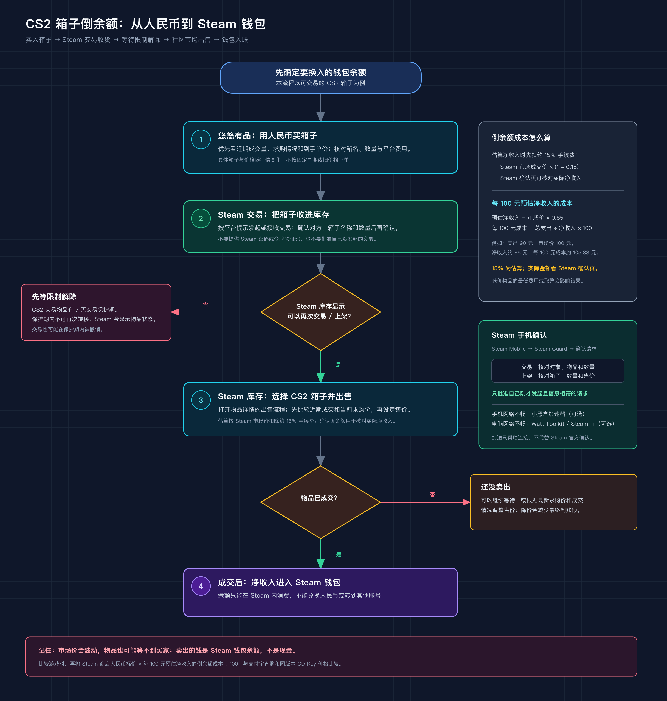

# Steam 钱包倒余额说明

> 内容类型：操作说明  
> 最近核对：2026-09-28  
> 适用示例：CS2 箱子、悠悠有品、Steam 社区市场

本文介绍玩家俗称的“Steam 倒余额”：用人民币在饰品平台购买可交易物品，经 Steam 交易转入自己的库存，再在 Steam 社区市场出售，成交款留在 Steam 钱包里。它不是 Steam 官方充值，也不能把 Steam 钱包余额提现成人民币。

## 操作流程

### 1. 挑选适合转手的 CS2 箱子

在悠悠有品等支持 Steam 饰品交易的平台搜索 CS2 箱子。不要只看某个平台的最低报价，还要核对：

- 游戏、箱子名称和数量是否完全相同；
- 平台显示的实际人民币支出，是否包含服务费或其他费用；
- Steam 市场近期成交、当前挂牌量和求购价，判断流动性；
- 物品是否能通过 Steam 交易转入，以及转入后是否有交易或上架限制。

箱子价格和流动性会变化，本文不固定推荐某一款箱子，也不按某个星期几推断“最佳买入时间”。下单前应重新比较平台报价与 Steam 市场数据。

### 2. 购买并通过 Steam 交易收货

按悠悠有品当时显示的流程购买物品，并按平台要求完成 Steam 交易。收到交易邀请后，在 Steam 交易页面和手机确认页面核对交易对象、箱子名称及数量，确认是自己发起或预期中的交易后再同意。

Steam 手机端的令牌设置、交易确认步骤和加速器下载入口，见[Steam 手机确认与账户安全设置](Steam手机确认与账户安全设置.md)。

**CS2 物品存在单独的 7 天 Trade Protected 保护期。** Valve 的说明是，CS2 中通过交易、社区市场等方式获得的物品在 7 天内受保护，期间不能再次转移或重新上架，且交易可能在保护期内被撤销。以库存中该物品的状态和 Steam 页面提示为准；保护期结束后再进行下一步。[Steam 官方 Trade Protected 说明](https://help.steampowered.com/zh-cn/faqs/view/365F-4BEE-2AE2-7BDD)

### 3. 在 Steam 社区市场出售

打开 Steam 库存，选择 Counter-Strike 2，再打开箱子物品详情并进入出售流程。若 Steam 显示物品仍不可交易或不可上架，先按物品详情中的限制提示等待。

设价时可以对照近期成交记录、当前求购价和在售数量：

- 想尽快成交，可以参考当前求购价附近的价格；
- 想争取更高金额，可以挂在其他卖家报价附近并等待；
- 挂牌价不等于实际到账，Steam 确认页面会展示费用和预计净收入，按净收入判断是否划算。

本文的快速估算按 CS2 市场约 15% 手续费计算：Steam 市场常见费率由 Steam 交易费 5% 与 CS2 游戏费 10% 组成，因此预估净收入为市场价 × 0.85。Steam 官方说明 Steam 交易费目前为 5%（设有最低收费），CS2 游戏费目前为 10%，且费用可能调整；低价物品的最低收费和取整也会令结果偏离 15% 估算。出售前仍要核对 Steam 确认页显示的预计净收入。[Steam 社区市场常见问题](https://help.steampowered.com/zh-cn/faqs/view/61F0-72B7-9A18-C70B)

### 4. 批量上架相同箱子

Steam 的 Multisell 多售页面适用于箱子、胶囊等**可叠放且属于 commodity 的同类物品**；不同磨损或外观的独特饰品不适用。批量流程可以由第三方页面生成多售链接，再到 Steam 官方页面填写价格和数量。下面以 Steam Bulk Sell 网站自述的步骤作操作参考，**不代表已经验证或推荐该站安全**；不愿公开库存或使用第三方页面时，直接从 Steam 库存逐件出售。

1. 在 Steam 隐私设置中，临时将个人资料和库存设为公开。第三方生成器只能读取公开库存；如果不想公开库存，可以跳过这一步，逐件从 Steam 库存出售。
2. 如果决定尝试这个第三方示例，打开 [Steam Bulk Sell 的 CS2 多售生成器](https://steambulksell.com/game/730)，输入自己的 Steam 个人资料链接、个性化网址或 SteamID64，然后加载公开库存。
3. 在列表中选择要出售的箱子种类，生成 Multisell 链接。该站自述只读取公开库存、不需要密码、API Key 或浏览器扩展，并注明与 Valve/Steam 无关联；这些是网站运营方的说明，不是独立安全审计结论。[多售说明](https://steambulksell.com/blog/cs2/01-multisell-cs2-cases-and-capsules) · [网站使用及公开库存说明](https://steambulksell.com/guides/how-to-use.html)
4. 打开生成的链接，检查地址栏确认页面属于 `steamcommunity.com`，并确认登录的是自己的 Steam 账号。Steam 多售页加载对应物品后，逐行设置价格和出售数量。
5. 在 Steam 页面确认总价、每件净到账和数量，再提交上架；若 Steam 手机令牌弹出确认请求，到官方 Steam Mobile 应用核对商品与售价后再确认。完成库存读取后，把个人资料和库存恢复为原来的隐私设置；该站说明会在当前浏览器的本地存储中记住输入的个人资料，可用页面上的 Clear profile 按钮清除。

**关于 Steam Bulk Sell 的安全性：**它是独立第三方网站，我没有对其代码、服务器或数据处理方式做过安全审计，无法保证它安全。公开操作说明称它会读取公开的 Steam 库存，并在当前浏览器本地存储中记住个人资料标识；我没有找到它公开的隐私政策或独立审计报告。[该站的库存说明](https://steambulksell.com/guides/public-inventory.html)是运营方自述，不是外部验证。若要尝试，只提供公开个人资料链接，不输入 Steam 密码、令牌码、恢复码或 API Key；只在地址栏确认为 `steamcommunity.com` 的页面登录和确认。对站点仍有顾虑时，跳过生成器，在 Steam 库存逐件上架。

Steam 在 2026 年更新了社区市场商品页、列表卡片与搜索筛选；多售生成器社区组也有用户反馈，新市场更新后旧链接里的物品 ID 不再匹配。社区讨论不是 Valve 对兼容性的官方说明，但足以提醒我们不要依赖手工拼接的固定链接。不要照抄旧版 CS:GO 箱名或未知脚本；应根据当前库存生成链接，并且只在 Steam 官方市场页面登录和最终确认。任何工具若要求提供 Steam 密码、手机令牌码、恢复码或 API Key，都不要继续。[Steam 市场更新说明](https://steamcommunity.com/games/593110/announcements/detail/673994309884707671) · [多售生成器社区讨论](https://steamcommunity.com/groups/multisellgenerator)

### 5. 等待成交并核对钱包到账

只有物品成功成交后，净收入才会进入 Steam 钱包。未成交时，余额转换还没有完成。市场价格、求购量和成交速度都可能变化，需要时可以重新查看行情并调整售价；降价会减少最终到账金额。

## 计算倒余额的实际成本

先记录人民币平台订单总支出和准备参考的 Steam 市场成交价。按照约 15% 手续费估算：

> **预估 Steam 钱包净收入 = Steam 市场成交价 × (1 − 0.15) = Steam 市场成交价 × 0.85**  
> **每 100 元预估净收入的倒余额成本 = 人民币总支出 ÷ 预估净收入 × 100**

例如，买入总支出为 90 元，Steam 市场参考价为 100 元，扣除约 15% 手续费后预估净收入为 85 元；每 100 元预估净收入的人民币成本约为 90 ÷ 85 × 100 = 105.88 元。若 Steam 确认页显示的实际预计净收入与估算不同，最终判断时以确认页为准。若 Steam 市场价以其他币种显示，先换算成与人民币支出相同的货币。

## 和支付宝直购、CD Key 比较

比较某一款游戏时，可以按下式估算倒余额购买成本：

> **倒余额估算支出 = Steam 商店当前人民币标价 × 每 100 元预估净收入的倒余额成本 ÷ 100**

再与 Steam 结账页面使用支付宝的实际金额，以及正规零售渠道同一款游戏、同一版本的 CD Key 价格比较。可以在 [SteamDB](https://steamdb.info/) 查询游戏价格历史和历史最低价；史低仅供参考，购买时还要确认地区、版本和包含的内容一致。

倒余额要花时间挑物品、处理交易、设置售价并等待成交；正规渠道 CD Key 通常更省操作，但实际价格需要逐款比较。不同游戏、地区和促销时期的结果各不相同，不能预设哪种方式一定便宜。

| 方式 | 成本依据 | 操作特点 |
| --- | --- | --- |
| Steam 商店支付宝直购 | Steam 结账页面的实际金额 | 操作直接，按商店现价支付 |
| 饰品倒余额 | 人民币实际支出 ÷ (Steam 市场参考价 × 0.85) | 按约 15% 手续费估算；要承担价格波动、等待成交和多步操作 |
| 正规渠道 CD Key | 对应游戏版本的实际购买价 | 通常更省事；需核对 Steam 平台、激活地区和版本 |

## 账户与交易安全

- 使用官方 Steam Mobile 应用处理登录、交易和市场确认。确认每一笔交易的对象、物品、数量和出售价格；不认识或不是自己发起的请求一律拒绝。
- 不向饰品平台、卖家、加速器、所谓客服或第三方网页提供 Steam 密码、Steam Guard 验证码、手机确认或恢复码。
- Steam 钱包余额不能兑换现金或转给其他账号。不要把倒余额理解为提现或保证盈利。
- 账号级的 Steam Guard 暂挂和 CS2 物品级的 7 天 Trade Protected 是两套不同机制，详细设置见[Steam 手机确认与账户安全设置](Steam手机确认与账户安全设置.md)。

## 参考资料

- [Steam 社区市场](https://steamcommunity.com/market/)
- [Steam 社区市场常见问题](https://help.steampowered.com/zh-cn/faqs/view/61F0-72B7-9A18-C70B)
- [Steam Trade Protected 物品说明](https://help.steampowered.com/zh-cn/faqs/view/365F-4BEE-2AE2-7BDD)
- [Steam 用户协议：Steam 钱包与社区市场](https://store.steampowered.com/subscriber_agreement/?l=schinese)
- [Steam Bulk Sell：CS2 箱子与胶囊多售教程（第三方参考，未独立审计）](https://steambulksell.com/blog/cs2/01-multisell-cs2-cases-and-capsules)
- [Steam Community Market Updates（2026）](https://steamcommunity.com/games/593110/announcements/detail/673994309884707671)
- [YouTube：Steam Multisell 原理演示（2021 年旧版界面，仅供理解多售概念）](https://www.youtube.com/watch?v=jqAFPCCVy3M)
- [SteamDB](https://steamdb.info/)
